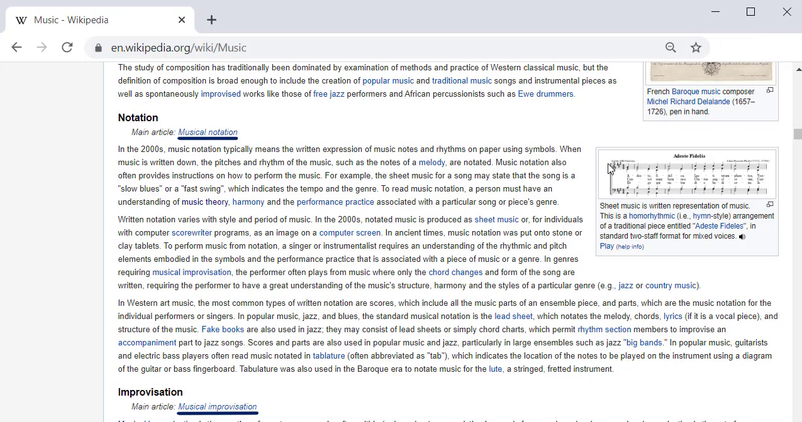

# Wikipedia Page Scraping

* Scraped a page(wikipedia in this case to get various pieces of information)
* Scraped subsequent links in the wikipedia page

**Packages:** requests, urllib, beautifulsoup

Scraped the following and more:
* **Titles**
* **Specific texts** 
* **In page links**
* **Music information**
* **Basic page information**

**The page:**

